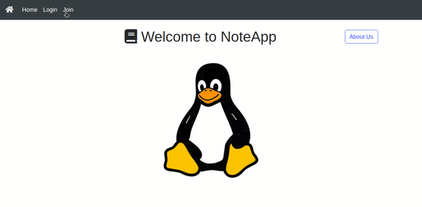

- You can make the server publicly 
```python
app.run(host='0.0.0.0', port=8000)
```

- Autosave code 
  
```js
var timeoutId;
$('#content').on('input propertychange change', function() {
  clearTimeout(timeoutId);
  timeoutId = setTimeout(function() {
    var text = $("#content");
    
      $.ajax({
      type: "POST",
      url: "{{ url_for('edit',note_id=context.note.id) }}",
      data: text,
      });
    
    },1000);
  });
```
- Markdown Filter

```python
#Import Python file
from flaskext.markdown import Markdown
markdown = Markdown(app)

#Import HTML file
{{note.content|markdown}}
```

